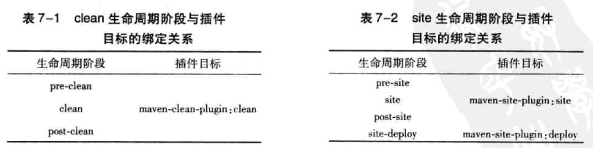
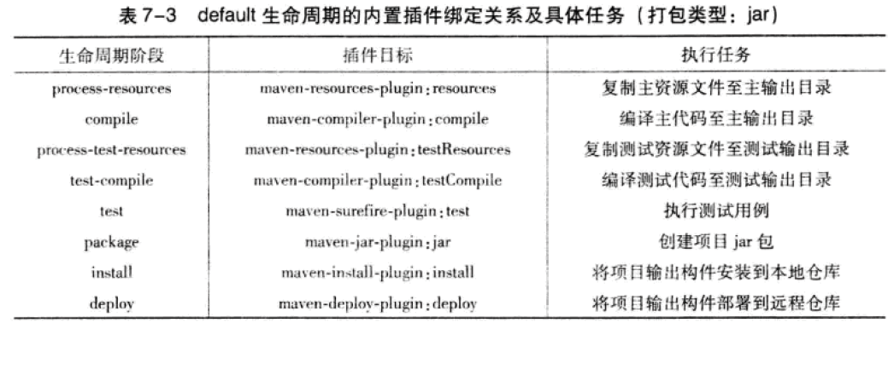
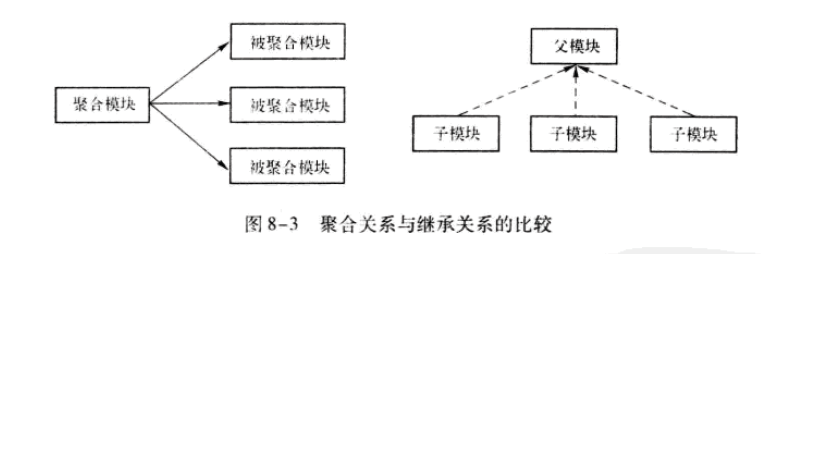
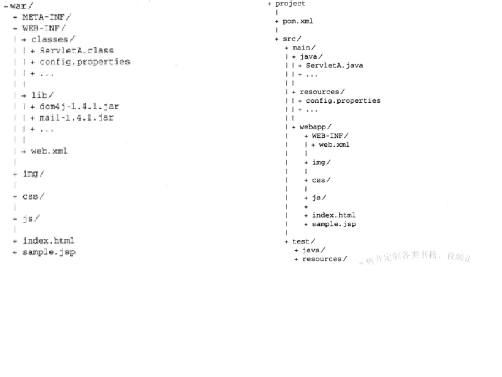

#Maven简介
Maven的两个核心概念：坐标和依赖。
##Maven坐标
通过一些元素进行定义，包括groupId、artifactId、version、packaging、classifier。
##依赖范围
依赖范围主要用来控制与三种classpath（编译classpath、测试classpath、运行classpath）的关系。

- compile:	编译依赖范围
- test:		测试依赖范围
- provided:	已提供依赖范围，例如Servlet-api，编译和测试需要，但运行时由容器提供，不需重复引入
- runtime:	运行时依赖
- system：	系统依赖范围；主要涉及本机系统绑定
- import:	导入依赖范围	

##Maven仓库
坐标和依赖是任何一个构件在Maven世界中的逻辑表示方式，构件的物理表示方式是文件，Maven通过仓库来统一管理这些文件。

-仓库布局 大致为：groupId/artifactId/version/artifactId-version.packaging

-仓库分类 对Maven来说，只分为本地参考和远程仓库。Maven查找构件次序：优先本地仓库，本地无则去远程仓库查找。*私服是一种特殊的远程仓库，为节省带宽和时间，应在局域网内假设一个私服*

###本地仓库
自定义本地仓库目录位置，例如C盘空间不足等。
修改～/.m2/setting.xml，设置localRespository元素的值

	<localRepository>D:/Java/apache-maven-3.0.5/local_repos</localRepository>
默认情况下，～/.m2/settings.xml文件不存在，用户需要从Maven的安装位置，复制一份%MAVEN_HOME%/conf/settings.xml拷贝再进行编辑。

### 从仓库解析依赖的机制

1. 当依赖范围是system时，Maven直接从本地文件系统解析构件
2. 根据依赖坐标计算仓库路径后，优先尝试直接从本地仓库寻找构件
3. 本地不存在，如果依赖版本是显式的发布版本构件，如1.2、1.2-beta-1等，则遍历所有远程仓库
4. 如果依赖的版本是RELEASE或者LATEST，则基于更新策略读取所有远程仓库的元数据groupId/artifactId/maven-metadata.xml,将其与本地仓库的对应元数据合并后，计算出RELEASE或者LATEST真实值，然后基于这个真实值检查本地和远程仓库
5. 如果依赖的版本是SNAPSHOT，则基于更新策略读取所有远程仓库的元数据groupId/artifactId/version/maven-metadata.xml,与本地元数据合并后得到最新快照版本的值，然后检查本地仓库，或者从远处仓库下载
6. 如果最后解析得到的构件版本是时间戳格式的快照，如1.4.1-20091104.121450-121,则复制其时间戳格式的文件至非时间戳格式，如SNAPSHOT，并使用该非时间戳格式的构件。

*当依赖的版本不明晰的时候，如RELEASE/LATEST/SNAPSHOT，Maven需要基于更新远程仓库的更新策略来检查更新*

### 仓库搜索服务
使用Maven进行日常开发，常见问题就是如何寻找需要的依赖，我们可能只知道需要使用类库的项目名称，但添加Maven依赖需要提供确切的Maven坐标；我们可以通过使用仓库搜索服务来根据关键字得到Maven坐标。

1. [MVNrepository](http://mvnrepository.com/)
2. [Sonatype Nexus](http://repository.sonatype.org/)

##在Windows上安装Maven
###检查JDK安装

	echo %JAVA_HOME%
	java -version		#查看Java版本
###下载Maven
###本地安装

1. 将压缩包解压到指定目录中，个人建议D:/java/apache-maven-3.0.5
2. 需要设置环境变量，将Maven安装配置到操作系统环境中
	
>
- 设置MAVEN_HOME，指向Maven安装目录：D:/java/apache-maven-3.0.5
- 修改PATH变量，在末尾添加";%MAVEN_HOME%/bin
检查设置
	
	echo %MAVEN_HOME%
	mvn -v               #查看Maven版本
### Maven设置

1. 全局设置，修改%MAVEN_HOME%/conf/settings.xml
2. 用户设置（在Linux多用户情况下），拷贝%MAVEN_HOME%/conf/settings.xml到～\.m2\settings.xml，修改此文件，在用户范围内定制Maven的行为。

### ～/.m2目录
1. 在用户目录下可以发现.m2文件夹。默认情况，该文件夹下放置了Maven本地仓库.m2/repository，所有Maven构件被存储在本地此目录下，以方便在多个项目间重用。
2. 在Linux多用户环境下，用户需要复制%MAVEN_HOME%/conf/settings.xml到～\.m2\settings.xml，这是一条最佳实践。
	
	mvn help:system		#打印当前Java系统属性和环境变量

###设置HTTP代理
编辑settings.xml，添加代理配置如下:

	<proxy>
      <id>optional</id>
      <active>true</active>
      <protocol>http</protocol>
      <username>proxyuser</username>
      <password>proxypass</password>
      <host>proxy.host.net</host>
      <port>80</port>
      <nonProxyHosts>local.net|some.host.com</nonProxyHosts>
    </proxy>
##Eclipse的Maven插件m2eclipse
[m2eclipse插件](http://eclipse.org/m2e/download/ "m2eclipse插件")，其中模块Maven Integrateion for WTP（Optional），可以让Eclipse自动读取POM信息，并配置WTP项目（支撑WEB应用开发）。

*备注*：需要配置Eclipse，调整vm配置指向本机JDK

##Maven安装最佳实践
###设置MAVEN_OPTS环境变量
通常需要配置MAVEN_OPTS=-Xms128m -Xmx512m，因为Java默认最大内存往往不能够不满足Maven运行的需要，否则很容易得到java.lang.OutOfMemoryError.
###不要使用IDE内嵌的Maven
###配置maven-compile-plugin支持Java5，默认只支持编译Java1.3(pom.xml配置）

				<!-- compiler插件, 设定JDK版本 -->
				<plugin>
					<groupId>org.apache.maven.plugins</groupId>
					<artifactId>maven-compiler-plugin</artifactId>
					<version>3.0</version>
					<configuration>
						<source>1.5</source>
						<target>1.5</target>
						<showWarnings>true</showWarnings>
					</configuration>
				</plugin>
				
###Maven生成可执行Jar包(pom.xml配置）
maven有两种生成可执行jar包的插件，能够自动加载依赖包。分别为 maven-assembly-plugin 和appassembler-maven-plugin。 

- appassembler-maven-plugin 的优势是能够自动生成window和linux的启动脚本
- maven-assembly-plugin 生成jar包后需要执行 java -jar **.jar命令运行jar包。

### Maven项目骨架

- 根目录中放置pom.xml
- src/main/java目录中，放置项目的主代码
- src/main/resources目录中，放置项目的的资源文件，如配置文件*.ini/*.xml/*.propeties
- src/test/java目录中，放置项目的测试代码

###排除依赖(pom.xml配置）

		<dependency>
			<groupId>log4j</groupId>
			<artifactId>log4j</artifactId>
			<version>1.2.15</version>
			<exclusions>
				<exclusion>
					<groupId>javax.jms</groupId>
					<artifactId>jms</artifactId>
				</exclusion>
				<exclusion>
					<groupId>com.sun.jdmk</groupId>
					<artifactId>jmxtools</artifactId>
				</exclusion>
				<exclusion>
					<groupId>com.sun.jmx</groupId>
					<artifactId>jmxri</artifactId>
				</exclusion>
				<exclusion>
					<groupId>javax.mail</groupId>
					<artifactId>mail</artifactId>
				</exclusion>
			</exclusions>
		</dependency>
		
###归类依赖(pom.xml配置）
	
	    <properties>
    		<!-- 主要依赖库的版本定义 -->
    		<cxf.version>2.7.4</cxf.version>
    	</properties>
    	<!-- SOAP begin -->
    	<dependency>
    		<groupId>org.apache.cxf</groupId>
    		<artifactId>cxf-rt-core</artifactId>
    		<version>${cxf.version}</version>
    		<exclusions>
    			<!-- use javax.mail.mail instead -->
    			<exclusion>
    				<groupId>org.apache.geronimo.specs</groupId>
    				<artifactId>geronimo-javamail_1.4_spec</artifactId>
    			</exclusion>
    			<!-- use javax.activation.activation instead -->
    			<exclusion>
    				<groupId>org.apache.geronimo.specs</groupId>
    				<artifactId>geronimo-activation_1.1_spec</artifactId>
    			</exclusion>
    		</exclusions>
    	</dependency>
    	<dependency>
    		<groupId>org.apache.cxf</groupId>
    		<artifactId>cxf-rt-frontend-jaxws</artifactId>
    		<version>${cxf.version}</version>
    		<exclusions>
    			<!-- see above -->
    			<exclusion>
    				<groupId>org.apache.geronimo.specs</groupId>
    				<artifactId>geronimo-javamail_1.4_spec</artifactId>
    			</exclusion>
    			<exclusion>
    				<groupId>org.apache.geronimo.specs</groupId>
    				<artifactId>geronimo-activation_1.1_spec</artifactId>
    			</exclusion>
    		</exclusions>
    	</dependency>
    	<dependency>
    		<groupId>org.apache.cxf</groupId>
    		<artifactId>cxf-rt-transports-http</artifactId>
    		<version>${cxf.version}</version>
    	</dependency>
    	<!-- SOAP end -->
	
### 约定优于配置
Maven提倡“约定优于配置”（Convention Over Configuration），这是Maven最核心的设计理念之一。原因之一是，使用约定可以大量减少配置。

对Maven 3，超级POM在文件$MAVEN_HOME/lib/maven-model-builder-x.x.x.jar中的org/apache/maven/model/pom-4.0.0.xml路径下。主要定义包括：

- 仓库及插件仓库
- 超级POM中关于项目结构约定的定义，包括：项目的主输出目录、主代码输出目录、最终构件的名称格式、测试代码输出目录、主源码目录、脚本源码目录、测试源码目录、主资源目录和测试资源目录。
- 核心插件版本设定
- 项目报告输出目录
- 项目发布的profile

###依赖优化（pom.xml配置)

	mvn dependency:list		#查看项目已解析依赖（Resolved Dependency）
	mvn dependency:tree		#查看当前项目的依赖树
	mvn dependency:analyze	#工具帮助分析当前项目的依赖，重点关注"Used undeclared dependencies"和"Unused declared dependencies"

###私服Nexus

####私服的好处

- 节省外网带宽
- 加速Maven构建
- 部署自有及第三方构件，如Oracle的JDBC驱动
- 提高稳定性，增强控制

####部署至远程仓库

- 修改settings.xml，添加远程仓库认证

    	<servers>  
    	  <server>  
    		<id>nexus-releases</id>  
    		<username>admin</username>  
    		<password>xxxxxx</password>  
    	  </server>  
    	  <server>  
    		<id>nexus-snapshots</id>  
    		<username>admin</username>  
    		<password>xxxxxx</password>  
    	  </server> 
    	  <server>  
    		<id>thirdparty</id>  
    		<username>admin</username>  
    		<password>xxxxxxx</password>  
    	  </server> 
    	</servers>	

- 修改pom.xml配置，指定部署的远程仓库位置

    	<project>  
    	...  
    	<distributionManagement>  
      	<repository>  
    	<id>nexus-releases</id>  
    	  <name>Nexus Release Repository</name>  
       	   <url>http://127.0.0.1:8080/nexus/content/repositories/releases/</url>  
      	</repository>  
      	<snapshotRepository>  
    	<id>nexus-snapshots</id>  
       	 <name>Nexus Snapshot Repository</name>  
    	<url>http://127.0.0.1:8080/nexus/content/repositories/snapshots/</url>  
      	</snapshotRepository>  
    	</distributionManagement>  
    	...  
    	</project>
	
## Maven生命周期和插件
除了坐标、依赖以及仓库外，Maven另外两个核心概念是生命周期和插件。

### Maven的生命周期
Maven的生命周期就是对所有的构建过程进行抽象和统一。
>生命周期包含了项目的清理、初始化、编译、测试、打包、集成测试、验证、部署和站点生成等几乎所有构建步骤。
>Maven生命周期是抽象的，生命周期本身不做任何实际的工作，实际任务都交由插件来完成。

#### 三套生命周期
Maven拥有三套相互独立的生命周期，分别为clean,default和site.

####clean生命周期：	目的是清理项目,包含三个阶段
1. pre-clean		执行清理前需要完成的工作
2. clean     		清理上一次构建生成的文件
3. post-clean		执行清理后需要完成的工作

#### default生命周期：	目的是构建项目
定义真正构建时所需要执行的所有步骤，重要阶段如下：

1. validate
2. initialize
3. generate-sources
4. process-sources   #处理项目主资源文件。一般对src/main/resources目录的内容进行变量替换等工作后，复制到项目输出的主classpath目录中。
5. generate-resources
6. process-resources 
7. compile			#编译项目的主源码，一般是编译src/main/java目录下的Java文件到项目输出的主classpath目录中
8. process-classes
9. generate-test-sources  #处理项目测试资源文件，一般对src/test/resources目录下内容进行变量替换等工作后，复制到输出的测试classpath目录中。
10. generate-test-resources
11. process-test-resources
12. test-compile    #编译项目测试代码。一般编译src/test/java目录下的Java文件到项目输出的测试classpath目录中。
13. process-test-classes
14. test            #使用单元测试框架运行测试，测试代码不会被打包或部署
15. prepare-package
16. package         #接受编译好的代码，打包成可发布的格式
17. pre-integration-test
18. integration-test
19. post-integration-test
20. verify
21. install         #将包安装到Maven本地仓库
22. deploy          #将最终的包复制到远程仓库，供其他开发人员和Maven项目使用
详细信息，可参阅 [Maven官方的解释](http://maven.apache.org/guides/introduction/introduction-to-the-lifecycle.html)

#### site生命周期
目的是建立和发布项目的站点，Maven能够基于POM所包含的信息，自动生成一个友好的站点，方便团队交流和发布项目信息。

1. pre-site
2. site        #生成项目站点文档
3. post-site
4. site-deploy #将生成的项目站点发布到服务器上。

 

 

### 插件配置

1. 命令行插件配置
例如针对测试插件maven-surefire-plugin，提供了maven.test.skip参数

    mvn install -Dmaven.test.skip=true 	#跳过测试

2. POM中插件全局配置
例如配置maven-compiler-plugin，编译java1.5版本的源文件，生成与jvm 1.5兼容的字节码文件。

### 在线插件信息
1. [Apache官方插件](http://maven.apache.org/plugins/index.html)

### Maven插件的聚合与继承的关系

多模块Maven项目中，聚合与继承是两个概念，聚合是为了方便快速构建多个项目，继承是为了消除重复配置。

聚合模块知道那些模块被聚合，但被聚合的模块不知道这个聚合模块的存在。

继承关系的父POM，它不知道哪些子模块继承于它，但子模块必须知道自己的父POM是什么。

聚合POM与继承关系中的父POM的packaging属性必须是pom，同时，聚合模块与继承关系中的父模块除了POM之外，都没有实际的内容。如图：

 

# Maven常用命令
	
	mvn clean compile	#编译
	mvn clean test		#测试
	mvn clean package	#打包
	mvn clean install	#将打包安装到Maven库（本地库）
	mvn clean deploy    #将项目勾结输出的构件部署到远程仓库

	mvn coberatura:coberature		#生成测试覆盖率报告

# Maven与Jenkins持续集成

## 持续集成的作用、过程和优势

1. 快速
2. 高频率
3. 自动
4. 构建
5. 所有源码
6. 反馈

一次完整的集成大致包括下面六个步骤

1. 	持续编译
2. 	持续数据库集成；持续集成包括数据库的集成，每次发现新的SQL脚本，就应该清理集成环境的数据库，重新创建表结构，并填入预备的数据。这样就能随时发现脚本的错误，
3. 	持续测试
4. 	持续审查；诸如Checkstyle和PMD之类的工具能够帮我们发现代码中的坏味道（Bad Smell)，持续集成可以使用这些工具来生成各类报告，如测试覆盖率、Checkstyle报告、PMD报告等。
5. 	持续部署；有些错误只有在部署后才能被发现，往往是具体容器或者环境相关的，自动化部署能够帮助进口发现这类问题。
6. 	持续反馈；持续集成的最后一步反馈，通常是一封电子邮件。基本规则：将集成失败报告发送给这次集成相关的代码提交者，项目经理应该收到所有失败报告。

持续集成的好处：

1. 尽早暴露问题
1. 减少重复操作
1. 简化项目发布 
2. 建立团队信心

## Maven构建WEB应用

### WEB项目的目录结构
在Java世界中，WEB项目的标准打包方式是WAR。WAR与JAR类似，只不过可以包含更多的内容，如JSP文件、Servlet、Java类、Web.xml配置文件、依赖JAR包、静态web资源（如HTML、CSS、JavaScript文件）等。

 

WAR包结构与Maven项目结构对应关系参见上图；另Maven项目中不存在依赖lib目录，Maven在用WAR方式打包时，会根据POM配置从本地仓库复制相应的JAR文件。

### 使用Tomcat Maven Plugin/jetty-maven-plugin进行测试

[Apache Tomcat Maven Plugin](http://tomcat.apache.org/maven-plugin.html)

### 使用Cargo实现自动化部署

[Cargo Maven plugin](http://cargo.codehaus.org/Maven2+plugin)

# 版本管理

- Subversion版本发布过程
>	$mvn clean install
> 
> 	$mvn commit pom.xml -m "prepare to release 1.0"
> 
> 	$svn copy -m "tag release 1.0" \
> 	https://svn.juvenxu.com/project/trunk \
> 	https://svn.juvenxu.com/project/tags/1.0 

## 自动化版本发布
Maven Release Plugin提供了版本发布自动化功能，只需要提供一些必要的信息，它就能帮我们完成上述所有版本发布所涉及的操作。

Maven Release Plugin主要有三个目标，分别是：

- release:prepare  准备版本发布
>
>1. 检查项目是否有未提交的代码
>2. 检查项目是否有快照版本依赖
>3. 根据用户的输入将快照版本升级为发布版
>4. 将POM中的SCM信息更新为标签地址
>5. 基于修改后的POM执行Maven构建
>6. 提交POM变更
>7. 基于用户输入为代码打标签
>8. 将代码从发布版本升级为新的快照版
>9. 提交POM变更

- release:rollback 回退release:prepare所执行的操作。将POM回退至release:prepare之前的状态，并提交。需要注意的是，该步骤不会删除release:prepare生成的标签，因此需要用户手动删除

- release:perform 执行版本发布。签出release:prepare生成的标签中的源代码，并在此基础上执行mvn deploy命令打包并部署构建至仓库。

1. 一般配置项目的SCM信息，在pom.xml如下：

    	<scm>
    	<connection>scm:svn:http://somerepository.com/svn_repo/trunk</connection>
    	<developerConnection>scm:svn:https://somerepository.com/svn_repo/trunk</developerConnection>
    	<url>http://somerepository.com/view.cvs</url>
    	<scm>

2. 配置maven-release-plugin提供标签基础目录

	<plugin>
    	<groupId>org.apache.maven.plugins</groupId>
    	<artifactId>maven-release-plugin</artifactId>
    	<configuration>
    		<tagBase>scm:svn:http://somerepository.com/svn_repo/tags</tagBase>
    		<autoVersionSubmodules>true</autoVersionSubmodules>
    	</configuration>
    </plugin>

*注意事项*

1. 系统必须提供svn命令行工具，Maven无法使用图形化的工具，如TortoiseSVN;
2. POM必须配置了可用的部署仓库，因为release:perform会执行deploy操作将构件发布到仓库中。

## 自动化创建分支

使用Maven Release Plugin的branch目标，它能够帮我们自动化这些操作：

1. 检查本地有无未提交的代码
2. 为分支更改POM的版本，例如从1.1.0-SNAPSHOT改为1.1.1-SNAPSHOT
3. 将POM中的SCM信息更新为分支地址
4. 提交以上更改
5. 将主干的代码复制到分支中
6. 修改本地代码使其回退到分支之前的版本（用户可以指定新的版本）
7. 提交本地更改

其中tagBase和branchBase并非是一定要配置的。如果为SVN仓库使用了标准的Subversion布局，即在平行的trunk/tags/branches目录下分别放置项目主干代码、标签代码和分支代码，那么Maven Release Plugin就能够自动根据主干代码位置计算出标签及分支代码位置，因此可以省略这两项配置。

>	$mvn release:branch -DbranchName=1.1.x  -DupdateBranchVersion=true -DupdateWorkingCopyVersion=false

#灵活的构建
Maven为了支持构建的灵活性，内置了三大特性，即属性、Profile和资源过滤。

## Maven 属性，分为6类

- 内置属性：常用有两个
>1.  ${basedir} #项目根目录，即包含pom.xml文件的目录
>2.  ${version} #表示项目版本

- POM属性：用户可以使用该类属性，引用POM文件中对应元素的值。
>
>1. ${project.build.sourceDirectory}  
>2. ${project.build.testSourceDirctory}
>3. ${project.build.directory}   #项目构建输出目录，默认target/
>4. ${project.outputDirectory}   #项目主代码编译输出目录，默认target/classes
>5. ${project.testOutputDirectory}  #项目测试代码编译输出目录，默认为target/test-classes
>6. ${project.groupId}
>7. ${project.artifactId}
>8. ${project.version}           #与${project}等价
>9. ${project.build.finalName}   #项目打包输出文件的名称，默认为${project.artifactId}-${project.version}.

- 自定义属性

    	<project>  
    	...  
    	<properties>  
    	<my.prop>hello</my.prop>  
    	</properties>  
    	...  
    	</project>
 然后可以在POM中其他地方，使用`${my.prop}`调用

- Settings属性，与POM属性同理，用户使用以`settings.`开头的属性引用settings.xml文件中的XML元素的值，如常用的`${settings.localRespository}`指向用户本地仓库的地址

- Java系统属性：所有Java系统属性都可以使用Maven属性引用，例如`${user.home}`指向了用户目录，用户可以使用`mvn help:system`查看所有的Java系统属性。

- 环境变量属性：所有的环境变量都可以使用以`env.`开头的Maven属性引用，例如`${env.JAVA_HOME}`指代了JAVA_HOME环境变量的值。用户可以使用`mvn help:system`查看所有的环境属性。

## 构建环境的差异及资源过滤

最常见的，就是数据库配置；针对开发/测试/产品环境使用不同的配置，手动更改；

Maven的答案是针对不同的环境生成不同的构件。
例如：在src/main/resources/目录下放置带有如下内容的数据库配置文件：

>	database.jdbc.driverClass 	= ${db.driver}
>	database.jdbc.connectionURL = ${db.url}
>	database.jdbc.username 		= ${db.username}
>	database.jdbc.password 		= ${db.password}

在这里定义了4个Maven属性:db.driver、db.url、db.username、db.password。前面介绍过自定义Maven属性，这里要做的是使用一个额外的`profile`将其包裹。

	<project>  
    ...  
    <profiles>  
        <profile>  
            <id>dev</id>  
            <properties>  
                <db.driver>...</db.driver>  
                <db.url>...</db.url>  
                <db.username>...</db.username>  
                <db.password>...</db.password>  
            </properties>  
        </profile>  
        <profile>  
            <id>test</id>  
            <properties>  
                <db.driver>...</db.driver>  
                <db.url>...</db.url>  
                <db.username>...</db.username>  
                <db.password>...</db.password>  
            </properties>  
        </profile>  
    </profiles>  
    ...  
	</project>  

添加配置，让Maven解析资源文件中的Maven属性。

	<project>  
    ...  
    <build>  
        <resources>  
            <resource>  
                <directory>${project.basedir}/src/main/resources</directory>  
                <filtering>true</filtering>  
            </resource>   
        </resources>  
    </build>  
    ...  
	</project>

最后，只需要在命令行激活profile，Maven就能够在构建项目的时候使用profile中的属性值替换数据库配置文件中的属性引用。运行命令行如下：

`$mvn clean install -Pdev`

mvn的`-P`参数表示在命令行激活一个profile。这里激活了id为dev的profile。构建完成后，输出目录中的数据库配置就是开发环境的配置了。

Maven支持很多种激活Profile的方式。

1. 命令行激活
2. settings文件显式激活；可以配置settings.xml文件的activeProfiles元素，表示其配置的profile对于所有项目都处于激活状态。
3. 系统属性激活
4. 操作系统环境激活
5. 文件存在与否激活

### 查看profile激活情况
1. 查看当前激活的profile

	$mvn help:active-profiles
2. 列出当前所有的profile

	$mvn help:all-profiles

### profile的种类
#### pom.xml  		
针对当前项目有效

POM中profile可使用的属性：

	<project>  
    <profiles>  
        <profile>  
            <build>  
                <defaultGoal>...</defaultGoal>  
                <finalName>...</finalName>  
                <resources>...</resources>  
                <testResources>...</testResources>  
                <plugins>...</plugins>  
            </build>  
            <reporting>...</reporting>  
            <modules>...</modules>  
            <dependencies>...</dependencies>  
            <dependencyManagement>...</dependencyManagement>  
            <distributionManagement>...</distributionManagement>  
            <repositories>...</repositories>  
            <pluginRepositories>...</pluginRepositories>  
            <properties>...</properties>  
        </profile>  
    </profiles>  
	</project>  
#### 用户settings.xml 	
针对本地该用户所有的Maven项目有效
#### 全局settings.xml 	
针对本机所有Maven项目有效

POM外部的profile可使用的属性,仅能用来影响项目的哦仓库和Maven属性。

	<project>  
            <repositories>...</repositories>  
            <pluginRepositories>...</pluginRepositories>  
            <properties>...</properties>  
	</project> 

## Web资源过滤

需要区分Web项目中一般资源文件和Web资源文件，一般资源文件通过maven-resources-plugin处理，Web资源通过maven-war-plugin处理。

# 生成项目站点

Maven除了自动化构建以及管理依赖关系外；它还能帮助聚合项目信息，促进团队交流。

POM包含各种项目信息，如项目描述、版本控制地址、缺陷跟踪系统地址、许可证信息、开发者信息等。可以让Maven自动生成一个Web站点，以Web形式发布这些信息。

另外Maven社区提供了大量插件，能让用户生成各种各样的项目审查报告，包括测试覆盖率、静态代码分析、代码变更等。

## 项目报告插件

下面介绍一些比较常用的报告插件。报告插件在POM中配置位置与一般插件配置不同。一般插件配置在`<project><build><plugins>`下配置，而报告插件在`<project><reporting><plugins>`下配置。

###JavaDocs

maven-javadoc-plugin使用JDK的javadoc工具，基于项目的源码生成JavaDocs文档；

### Source Xref

Maven会以Web页面的形式将java源代码展现出来。

### CheckStyle

CheckStyle是一个用来帮助Java开发人员遵循编码规范的工具，能根据一套规则自动检查Java代码。

默认情况下，maven-checkstyle-plugin会使用Sun定义的编码规范，插件内置了四种规则：

- config/sun_checks.xml  	#Sun定义的编码规范（默认值）
- config/maven_checks.xml	#Maven社区定义的编码规范
- config/turbine_checks.xml #Turbine定义的编码规范
- config/avalon_checks.xml	#Avalon定义的编码规范

#### 自定义编码规范

用户可以创建自己的编码规范，通常如下：

1. 在src/main/resources/目录下定义一个checkstyle/my_checks.xml文件
2. 配置<configLocation>checkstyle/my_checks.xml</configLocation>
maven-checkstyle-plugin实际从ClassPath载入规则文件。

### PMD

PMD是一款强大的Java源代码分析工具，可以寻找代码中的问题，包括

- 潜在的Bug
- 无用代码
- 可优化代码
- 重复代码
- 过于复杂的表达式

PMD工具详细信息可以访问[http://pmd.sourceforge.net/](http://pmd.sourceforge.net/)

除生成PMD报告之外，maven-pmd-plugin还会生成一个名为CPD的报告，该报告中包含了*代码拷贝粘贴*的分析结果。

PMD包含了大量的分析规则，可以访问[http://pmd.sourceforge.net/rules/index.html](http://pmd.sourceforge.net/rules/index.html)查看这些规则。

### ChangeLog

maven-changlog-plugin 能够基于版本控制系统中就近的变更记录生成三份变更报告

- ChangeLog		#基于提交的变更报告，包括每次提交的日期、文件、作者、注释等信息
- Developer Activity		#基于作者的变更报告，包括作者列表以及每个作者相关的提交次数和涉及文件数目
- File Actibity			#基于文件的变更报告，包括变更的文件列表及美国文件的变更次数

生成项目的变更报告，需要配置正确的SCM信息；默认情况，插件生成最近30天的变更记录，不过用户可以修改默认值。

### Cobertura

在Site站点中，生成Cobertura测试覆盖率报告，需配置cobertura-maven-plugin插件。

### Surefire Report Plugin 单元测试报告

## 自定义站点外观

### 国际化

- 确保项目所有源码，包括pom.xml等资源文档，都以`UTF-8`编码保存
- 告知maven-site-plugin插件，使用`UTF-8`编码读取所有源码及文档，同样使用`UTF-8`编码呈现站点html文档。需配置两个Maven属性

	<properties>
    	<project.build.sourceEncoding>UTF-8</project.build.sourceEncoding>
		<project.reporting.outputEncoding>UTF-8</project.reporting.outputEncoding>
 	</properties>

- 配置maven-site-plugin指定当地的语言，配置当地语言为简体中文`zh_CN`

